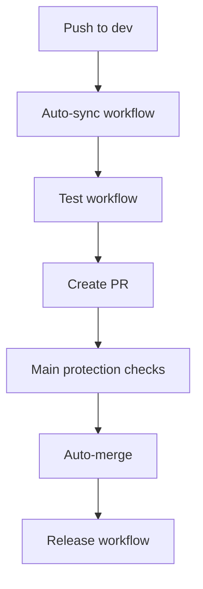

# Auto-sync Dev to Main - Best Practices Implementation

## Overview

This workflow implements industry best practices for automatically syncing changes from the `dev` branch to the `main` branch while maintaining code quality and providing proper audit trails.

## 🔄 How It Works

### Trigger Conditions
The workflow runs when:
1. **Push to dev branch** - Automatically evaluates if sync is needed
2. **Manual trigger** - Can be manually triggered with optional force sync

### Safety Checks (Multi-layered Validation)

#### 1. **Meaningful Changes Detection**
- Excludes documentation-only changes (`.md`, `.txt` files)
- Excludes workflow/config changes (`.github/`, `scripts/`)
- Excludes test scenarios (`test-*` files)
- Only syncs when actual code changes are detected

#### 2. **Version Bump Requirement**
- Compares `package.json` version between dev and main
- Requires version to be bumped before auto-sync
- Follows semantic versioning best practices

#### 3. **Test Suite Validation**
- Runs complete test suite before creating PR
- Includes linting, type checking, and unit tests
- Security audit scanning
- Only proceeds if all tests pass

#### 4. **Status Check Validation**
- Waits for all GitHub status checks to complete
- Validates PR is in "clean" mergeable state
- Fails fast if conflicts or failed checks detected

## 🎯 Best Practices Implemented

### 1. **GitFlow Compliance**
- Maintains proper branch hierarchy (dev → main)
- Preserves commit history through squash merging
- Creates audit trail through PR process

### 2. **Quality Gates**
- Multiple validation layers prevent bad code from reaching main
- Automated testing ensures functionality
- Version control prevents accidental releases

### 3. **Transparency & Auditability**
- Creates detailed PR descriptions with commit summaries
- Adds appropriate labels for tracking
- Provides comprehensive logging and notifications

### 4. **Fail-Safe Mechanisms**
- Timeouts prevent hanging workflows
- Graceful error handling with detailed messages
- Manual override capability when needed

### 5. **Resource Optimization**
- Conditional execution saves CI/CD resources
- Efficient change detection algorithms
- Proper timeout management

## 🚦 Workflow States

### ✅ **Successful Auto-sync**
```
Push to dev → Changes detected → Version bumped → Tests pass → PR created → Auto-merged → Release triggered
```

### ⏸️ **Skipped (No Action Needed)**
- No meaningful changes detected
- Version not bumped
- Dev branch not ahead of main

### ❌ **Failed Auto-sync**
- Tests failed
- Merge conflicts detected
- Status checks failed
- Manual intervention required

## 🔧 Configuration Options

### Manual Trigger Options
```yaml
workflow_dispatch:
  inputs:
    force_sync:
      description: 'Force sync even if no changes detected'
      type: boolean
      default: false
```

### Customizable Conditions
You can modify the sync conditions in the workflow:

```yaml
# Example: Sync only on specific file patterns
CHANGED_FILES=$(git diff --name-only $MAIN_SHA..$DEV_SHA | grep -E '\.(ts|js|json)$' | wc -l)

# Example: Require specific commit message patterns
if git log --oneline $MAIN_SHA..$DEV_SHA | grep -q "feat\|fix\|BREAKING"; then
  echo "Release-worthy changes detected"
fi
```

## 📋 Usage Examples

### Automatic Sync (Recommended)
1. Work on `dev` branch
2. Bump version using `npm run release:prepare`
3. Push to dev
4. Workflow automatically creates and merges PR to main
5. Release workflow triggers automatically

### Manual Sync
1. Go to Actions tab in GitHub
2. Select "Auto-sync Dev to Main" workflow
3. Click "Run workflow"
4. Optionally enable "Force sync"

### Emergency Override
If auto-sync fails but you need to sync urgently:
1. Create manual PR from dev to main
2. Review and merge manually
3. Investigate auto-sync failure for future fixes

## 🛡️ Security Considerations

### Permissions
The workflow uses minimal required permissions:
- `contents: write` - For creating commits and tags
- `pull-requests: write` - For creating and merging PRs
- `actions: read` - For checking workflow status
- `checks: read` - For validating status checks

### Token Usage
- Uses `GITHUB_TOKEN` (automatically provided)
- No additional secrets required
- Follows principle of least privilege

## 🔍 Monitoring & Troubleshooting

### Common Issues

#### 1. **Auto-sync Skipped**
**Cause**: No meaningful changes or version not bumped
**Solution**: Ensure you've made code changes and bumped version

#### 2. **Tests Failed**
**Cause**: Code quality issues
**Solution**: Fix failing tests on dev branch before pushing

#### 3. **Merge Conflicts**
**Cause**: Divergent changes between dev and main
**Solution**: Manually resolve conflicts and retry

#### 4. **Status Checks Failed**
**Cause**: External checks (like branch protection rules) failed
**Solution**: Review and fix the failing checks

### Debugging Steps
1. Check workflow logs in Actions tab
2. Review PR comments for detailed error messages
3. Verify branch protection rules are compatible
4. Ensure all required status checks are configured

## 🔄 Integration with Existing Workflows

### Compatibility
This workflow integrates seamlessly with your existing setup:
- **test.yml**: Called as a reusable workflow
- **main-protection.yml**: Validates PR requirements
- **release.yml**: Triggered automatically after merge
- **auto-merge.yml**: Handles Dependabot PRs separately

### Workflow Dependencies


## 📈 Benefits

### For Development Teams
- **Reduced Manual Work**: Eliminates manual PR creation and merging
- **Consistent Process**: Standardized sync procedure
- **Quality Assurance**: Multiple validation layers
- **Audit Trail**: Complete history of all syncs

### For Project Management
- **Predictable Releases**: Automated release triggers
- **Risk Mitigation**: Comprehensive testing before merge
- **Compliance**: Proper documentation and approval process
- **Efficiency**: Faster time-to-production

## 🎛️ Customization Guide

### Modify Sync Conditions
Edit the `check-sync-conditions` job to add custom logic:

```yaml
# Example: Only sync on Fridays
- name: Check day of week
  run: |
    if [ "$(date +%u)" != "5" ]; then
      echo "Only sync on Fridays"
      exit 1
    fi
```

### Add Custom Notifications
Extend the `notify-result` job:

```yaml
# Example: Slack notification
- name: Notify Slack
  if: needs.auto-merge-pr.result == 'success'
  uses: 8398a7/action-slack@v3
  with:
    status: success
    text: "Dev branch successfully synced to main!"
```

### Custom PR Templates
Modify the PR body in `create-sync-pr` job to match your team's requirements.

---

This implementation follows industry best practices and provides a robust, maintainable solution for automated branch synchronization while maintaining code quality and team collaboration standards.